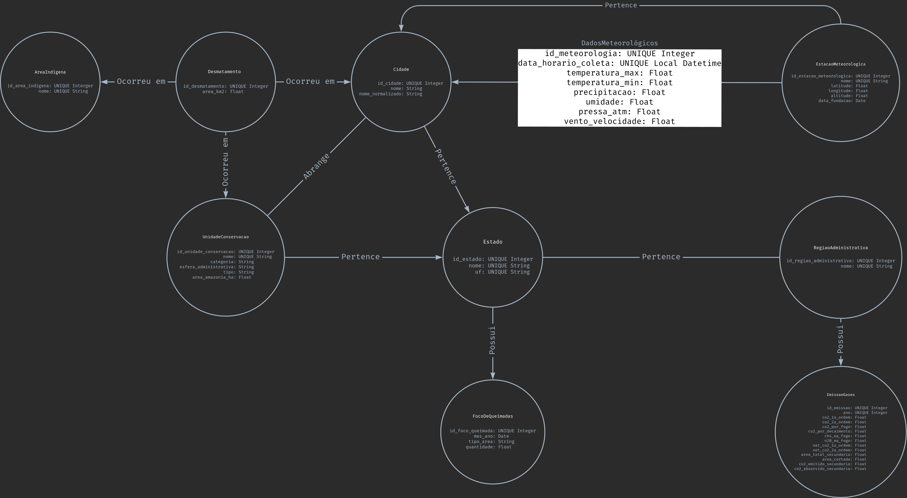

# Projeto 2 - MC536

## Visão Geral

Projeto para a disciplina de Banco de Dados da Unicamp. O objetivo do projeto é realizar a migração do [Projeto 1](https://github.com/PedroAfb/MC536), que utiliza o Postgres, para o banco NoSQL Neo4j.

Desenvolvido por:

- [Pedro Borges](https://github.com/JoaoVgon31) (260628)
- [João Vitor](https://github.com/PedroAfb) (237871)

## Discussão sobre a escolha do Neo4j para o cenário C

Diante de um cenário onde a **representação explícita de relações complexas entre entidades** é essencial, optamos pelo **Neo4j**, um banco de dados orientado a grafos. Essa escolha se justifica pelos seguintes aspectos:

### Forma de armazenamento de arquivos

O Neo4j utiliza um modelo de **armazenamento em grafo**, no qual nós, relacionamentos e propriedades são persistidos de forma otimizada para navegação em conexões. Diferentemente de bancos relacionais que armazenam dados em tabelas ou de bancos não relacionais orientados a documentos ou colunas, nos quais precisam realizar joins custosos, o Neo4j armazena as conexões diretamente entre os elementos, permitindo acessos rápidos e eficientes em consultas de múltiplos níveis.

Dessa forma, para nosso cenário, na arquitetura de nossos dados e como queremos consultá-los, a otimização da navegação entre nós, permitiu uma relevante otimização em nossas consultas, que focam justamente em achar padrões e correlacionar dados.

### Linguagem e processamento de consultas

O banco adota a linguagem Cypher, desenhada especificamente para lidar com padrões de relacionamento. Ela permite consultas concisas e intuitivas sobre caminhos e estruturas complexas no grafo. Isso é particularmente vantajoso no nosso cenário, onde as consultas envolvem relações indiretas e múltiplos níveis de relacionamento, como identificar padrões em cadeias de conexões ou entidades relacionadas por diversos caminhos. Em comparação, DuckDB e MongoDB exigiriam abordagens mais verbosas e menos performáticas para esse tipo de tarefa.

### Processamento e controle de transações

O Neo4j oferece suporte completo às propriedades ACID (Atomicidade, Consistência, Isolamento e Durabilidade), garantindo integridade dos dados mesmo em operações complexas sobre múltiplas entidades conectadas. Isso atende ao requisito de regras de consistência fortes e suporte transacional, algo crítico no nosso contexto, onde falhas em transações intermediárias poderiam comprometer múltiplos relacionamentos em cadeia.

### Segurança e Mecanismos de recuperação

O banco oferece mecanismos avançados de autenticação e controle de acesso baseado em papéis (RBAC - Role-based acess control), permitindo definir permissões específicas por tipo de dado ou operação. Esse mecanismo é importante em sistemas que lidam com diferentes tipos de usuários e informações sensíveis ligadas por conexões lógicas.
O Neo4j possui mecanismos robustos de recuperação de falhas, incluindo logs de transação (WAL), checkpoints periódicos e recuperação automática em casos de interrupção inesperada. Esses mecanismos garantem que, mesmo em caso de falha, o banco possa ser restaurado a um estado consistente, atendendo às exigências de durabilidade e confiabilidade do sistema.

### Conclusão

Frente à necessidade de navegar por relações profundas e complexas, manter forte consistência nas consultas e nos dados e garantir desempenho em consultas altamente relacionais, o Neo4j e seu banco de dados orientado a grafos se mostrou a escolha mais adequada. Bancos como MongoDB ou DuckDB, embora eficientes em outros contextos (documentos ou análises tabulares), não oferecem uma estrutura tão bem adaptada à natureza altamente conectada do conjunto de dados que enfrentamos.

## Objetivo do Projeto

Esse projeto tem como objetivo reunir dados relacionados direta ou indiretamente a Amazonia Legal, e mostrar dados de degradação da região relacionados a outros fatores relevantes.

## Esquema do Banco de Dados

### Modelo Lógico

### Modelo Físico

- [SQL DDL Script](docs/create_database.sql)

## Migração do Postgres para o Neo4j

- Pegamos todas as tabelas que tínhamos no Postgres e transformamos em CSVs. Dessa forma, todo o processo de ETL que realizamos entre os datasets originais e a inserção no banco é reaproveitado através dos CSVs.
- Seguimos o modelo lógico do Neo4j acima e populamos o banco de acordo com todos os arquivos inserts_* e o [Insert_all](https://github.com/PedroAfb/Projeto2-MC536/blob/main/insert_all.ipynb)

## Dicionario de Dados

### Entidades e Atributos

- **Cidade**: Unidade administrativa municipal oficialmente reconhecida no Brasil. Serve como base geográfica para associar dados de desmatamento, unidade de conservação e meteorologia. Imutável enquanto o município existir oficialmente. Inclui todas as cidades que façam parte de Estados que fazem parte da Amazônia Legal.

  - Atributos:
    - _nome_normalizado_: nome da cidade em minúsculo e sem acentos. Para fins de preenchimento do banco de dados.

- **Estado**: Unidade federativa que compõe a divisão administrativa do Brasil. Serve como base geográfica para associar dados de desmatamento, cidades, meteorologia e queimadas. Imutável enquanto o Estado existir oficialmente. Inclui todos os Estados que fazem parte da Amazônia Legal.

- **Região Administrativa**: Conjunto de estados agrupados com base em critérios geográficos, socioeconômicos ou administrativos. Serve como base geográfica para associar dados de estados em desmatamento, meteorologia, queimadas e emissão. Inclui as grandes regiões do Brasil segundo o IBGE (Norte, Sul, Sudeste, Centro-Oeste e Nordeste), e a região da Amazônia Legal. Imutável, exceto em casos de reconfiguração das regiões.

- **Unidade de Conservação**: Área protegida por lei com o objetivo de conservação ambiental, podendo permitir ou restringir o uso humano. Usada como base geográfica para associar dados de desmatamento. Inclui todas as unidades de conservação presentes no CNUC (Cadastro Nacional de Unidades de Conservação), mantido pelo MMA (Ministério do Meio Ambiente), até o 2o semestre de 2024. Dados de cadastro atualizados semestralmente podem conter alterações, porém dificilmente ocorrem alterações.

  - Atributos:
    - _area_amazonia_ha_: área em hectares ocupada pela unidade de conservação no território da Amazônia Legal
    - _esfera_administrativa_: indica qual nível de governo administra a unidade (federal, estadual, municipal)
    - _tipo_: Classificação geral da unidade quanto ao tipo de proteção e nível de intervenção humana (Proteção Integral ou Uso Sustentável)
    - _categoria_: Classificação da unidade quanto ao tipo de proteção e objetivo (por exemplo, Parque, Reserva Biológica, Estação Ecológica). Subclassificação de tipo

- **Área Indígena**: Território reconhecido como de ocupação tradicional de povos indígenas, com posse permanente e usufruto exclusivo. em áreas protegidas. Usada como base geográfica para associar dados de desmatamento. Inclui todas as áreas indígenas presentes na Amazônia Legal cujos dados de desmatamento foram disponibilizados pelo PRODES (Projeto de Monitoramento do Desmatamento na Amazônia Legal por Satélites), por meio da plataforma TerraBrasilis. Imutável após registro do relatório.

- **Estação Meteorológica**: Instalação com instrumentos para registrar dados climáticos automaticamente. Usada como base geográfica para associar dados de meteorologia. Inclui todas as estações meteorológicas presentes nos relatórios de meteorologia disponibilizados pelo INMET (Instituto Nacional de Meteorologia) de 2000 a 2024. Imutável após registro do relatório.

- **Desmatamento**: Registro anual da área desmatada em determinada cidade/unidade de conservação/área indígena. Usada para avaliar desmatamento e impacto ambiental. Imutável após registro do relatório.

  - Atributos:
    - _area_km2_: área desmatada em quilômetros quadrados

- **Dados Meteorológicos**: Registro de dados climáticos diários, hora em hora, por estação meteorológica. Usada para avaliar dados meteorológicos e impacto ambiental. Imutável após registro do relatório.

  - Atributos:
    - _temperatura_max_: temperatura máxima registrada na hora anterior, em graus Celsius
    - _temperatura_min_: temperatura mínima registrada na hora anterior, em graus Celsius
    - _precipitacao_: precipitação total na hora de medição, em milímetros
    - _umidade_: umidade relativa do ar na hora de medição, em porcentagem
    - _velocidade_vento_: velocidade do ar na hora de medição, em metros por segundo

- **Emissão de Gases**: Consolidação anual das emissões e absorções de gases de efeito estufa por região. Usada para avaliar emissão e impacto ambiental. Imutável após registro do relatório.

  - Atributos:
    - _co2_1a_ordem_: emissão de CO2 de 1 ordem. A medida de 1a ordem supõe de modo simplificado que 100% das emissões ocorram no momento da mudança de uso/cobertura
    - _co2_2a_ordem_: emissão de CO2 de 2 ordem. A medida de 2a ordem busca representar o processo gradativo de liberação e absorção do carbono como ocorre de fato
    - _co2_por_fogo_: parcela de emissão de CO2 2 ordem especificamente por fogo
    - _co2_por_decaimento_: parcela de emissão de CO2 2 ordem especificamente por decaimento natural de biomassa
    - _ch4_eq_fogo_: emissão de CH4 em carbono equivalente[^1]
    - _n2o_eq_fogo_: emissão de N2O em carbono equivalente[^1]

[^1]: Quantidade expressa em termos do impacto que teria se fosse CO2

- **Focos de Queimadas**: Registros de pontos de calor detectados por satélite, indicando possível queimada. Usada para avaliar focos de queimada e impacto ambiental. Imutável após registro do relatório.

### Relacionamentos

- **Desmatamento _ocorreu em_ Cidade/Unidade de Conservação/Área Indígena**: representa o local em que aconteceu o desmatamento referenciado. O desmatamento pode ocorrer em Cidade, Unidade de Conservação e Área Indígena, mas um mesmo relatório pode ter relação apenas com uma dessas entidades por vez. É definido no momento de cadastro do relatório e não pode ser alterado.

- **Estação Meteorológica _Dados Meteorológicos_ Cidade**: representa uma coleta de dados meteorológicos em uma data e hora de uma estação que pertence a uma cidade. Definido no momento de cadastro do relatório e não pode ser alterado.

- **Estação Meteorológica _pertence a_ Cidade**: representa a cidade em que a estação meteorológica está localizada. Definido no momento de cadastro da estação meteorológica e não pode ser alterado.

- **Cidade _pertence a_ Estado**: representa o Estado em que a cidade está localizada. Definido no momento de cadastro da cidade e não pode ser alterado.

- **Unidade de Conservação _pertence a_ Estado**: representa o Estado em que a unidade de conservação está localizada. Definido no momento do cadastro da unidade de conservação e não pode ser alterado.

- **Unidade de Conservação _abrange_ Cidades e Cidades _abrange_ Unidade de Conservação**: representa as cidades em que o território da unidade de conservação está presente ou o contrário. Definido no momento do cadastro da unidade de conservação e pode ser alterado caso ocorram mudanças no território da área de conservação.

- **Focos de Queimadas _pertence a_ Estado**: representa o Estado em que aconteceram os registro do foco de queimadas referenciado. Definido no momento do cadastro do relatório e não pode ser alterado.

- **Estado _pertence a_ Região Administrativa ou Regiao Administrativa _pertence a_ Estado**: representa a região administrativa à qual o Estado pertence ou o contrário. Um Estado pode pertencer a diferentes regiões administrativas. Definido no momento do cadastro do Estado e não pode ser alterado.

- **Emissão de Gases _pertence a_ Região Administrativa**: representa a região administrativa à qual os dados de emissão de gases se referem. Definido no momento do cadastro do relatório e não pode ser alterado.

## Scripts de Preenchimento do Banco de Dados

O preenchimento do banco de dados foi feito em **Python**, usando a biblioteca **neo4j**, com **Jupyter Notebook** para ajudar no controle de execução. Cada script segue uma estrutura padrão, contendo uma seção de inicial para realizar a conexão com o banco.

O arquivo [insert_all](https://github.com/PedroAfb/Projeto2-MC536/blob/main/insert_all.ipynb) reúne todos os scripts individuais, permitindo executar todo o setup do banco de forma integrada e sequencial. Para mais detalhes veja a secão [Setup e Execução](#setup-e-execução)

Vale notar que nem todos os campos dos datasets originais foram utilizados, e alguns dados precisaram ser tratados ou derivados a partir dos dados dos datasets.

### insert_estado_&_rg.ipynb

- Insere estados e regioes administrativas

### insert_area_indigena

- dataset: [Desmatamento](#desmatamento)
- Insere áreas indígenas

### insert_emissao

- dataset: [Emissao de Gases Amazônia Legal](#emissão-de-gases-amazônia-legal)
- Insere relatórios de emissão de gases
- Relaciona com regiões administrativas

#### insert_queimadas

- dataset: [Foco de Queimadas](#foco-de-queimadas)
- Inserte relatório de queimadas
- Relaciona com Estados

### insert_cidade

- dataset: [Cidades](#cidades)
- Insere cidades
- Relaciona com Estados

### insert_unidade_conservacao

- dataset: [Unidades de Conservação](#unidades-de-conservação)
- Insere unidades de conservação
- Relaciona com Estados
- Relaciona com Cidades

### insert_meteorologia

- dataset: [Meteorologia](#meteorologia)
- Insere estações meteorológicas
- Insere relatórios de meteorologia
- Relaciona cidade com estações meteorológicas
- Relaciona a aresta de dados meteorológicos 

### insert_desmatamento

- dataset: [Desmatamento](#desmatamento)
- Insere relatórios de desmatamento
- Relaciona com Cidades ou Áreas Indígenas ou Unidades de Conservação

## Setup e Execução

O arquivo [insert_all](inserts/insert_all.ipynb) está organizado para preencher o banco de dados executando cada célula do notebook de forma sequencial. Ele reúne todos os scripts de inserção descritos anteriormente e garante que sejam executados na ordem correta.

Para começar:

1. **Crie o banco de dados Postgres**
2. **Execute o script do arquivo [create_database](docs/create_database.sql)** para criar os esquemas necessários no banco
3. **Atualize as configurações de conexão no arquivo [DATABASE_CONFIG](inserts/DATABASE_CONFIG.py)**
4. Após confirmar a conexão bem-sucedida, **execute os blocos do notebook [insert_all](inserts/insert_all.ipynb) em ordem**, garantindo o carregamento completo dos dados no banco.

## Consultas e Resultados

### Consulta 1

Esta consulta identifica, para cada estação meteorológica, o dia com a maior variação diária de temperatura (diferença entre a máxima e mínima) registrada, mostrando a data, os valores extremos do dia e a variação, além de calcular a média geral das variações diárias daquela estação ao longo do período; os resultados incluem também o nome da estação, cidade e estado, permitindo comparar os dias mais extremos de cada local com seu comportamento médio, tudo organizado em ordem decrescente pela maior variação registrada.

- [Script](consultas/consulta_1.txt)
- [Resultado CSV](consultas/resultado_1.csv)

### Consulta 2

Esta consulta calcula, para cada cidade que possui pelo menos uma unidade de conservação exclusiva\*, a área total desmatada entre 2008 e 2024, separando quanto desse desmatamento ocorreu dentro dessas unidades exclusivas e quanto ocorreu no restante da cidade, e então calcula o percentual que as áreas exclusivas representam no total desmatado da cidade; ao final, ela lista essas cidades ordenadas do maior para o menor percentual de desmatamento vindo de unidades exclusivas, permitindo identificar quais municípios mais concentram seu desmatamento dentro dessas áreas específicas.

- \*Unidade de conservacão exclusiva é aquela associada somente a uma cidade, ou seja, cujo território abrange apenas uma cidade

- [Script](consultas/consulta_2.txt)
- [Resultado CSV](consultas/resultado_2.csv)

### Consulta 3

Esta consulta reúne, para cada ano, os dados agregados da Amazônia Legal combinando três grandes dimensões: (1) o total anual de emissão de gases de efeito estufa, (2) a temperatura média anual calculada a partir das médias estaduais (baseada em temperaturas máximas e mínimas), e (3) o total anual de focos de queimadas registrados; ela cruza essas informações ano a ano, garantindo que só sejam considerados os anos onde há dados disponíveis em todas as três fontes, e entrega uma visão consolidada que permite analisar possíveis correlações entre temperatura, queimadas e emissões na região ao longo do tempo.

- [Script](consultas/consulta_3.txt)
- [Resultado CSV](consultas/resultado_3.csv)

### Consulta 4

Esta consulta retorna as 10 áreas mais desmatadas, considerando tanto áreas indígenas quanto unidades de conservação, combinando os dados das duas entidades. Para cada área, ela exibe o nome, o tipo (explicitamente marcado como Área Indígena ou Unidade de Conservação) e o total acumulado de desmatamento em km², ordenando os resultados do maior para o menor total desmatado e limitando a exibição às dez primeiras posições, ou seja, às áreas mais impactadas pelo desmatamento.

- [Script](consultas/consulta_4.txt)
- [Resultado CSV](consultas/resultado_4.csv)

### Consulta 5

Essa consulta tem como objetivo calcular, para cada uma das cinco grandes regiões administrativas do Brasil (Norte, Nordeste, Centro-Oeste, Sudeste e Sul), a soma total da área da Amazônia presente nas unidades de conservação localizadas em seus estados, a soma total da área desmatada nessas unidades e o percentual que essa área desmatada representa em relação à área total amazônica.

- [Script](consultas/consulta_5.txt)
- [Resultado CSV](consultas/resultado_5.csv)
